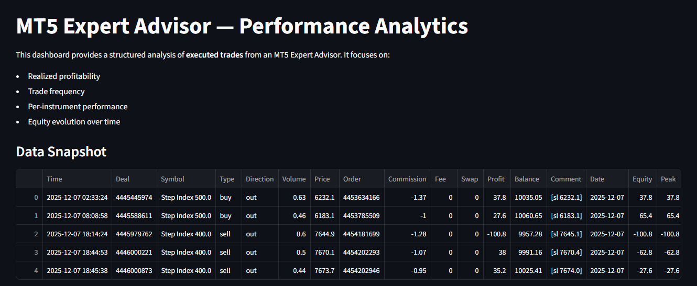

# MT5 EA Performance Analytics Dashboard

## Overview
An end-to-end quantitative analytics project that transforms raw MetaTrader 5
EA trade history into a professional, interactive performance dashboard.

## Key Features
- Automated trade data extraction & cleaning
- Per-instrument equity curves
- Profit attribution analysis
- Risk metrics (drawdown, win rate)
- Strategy rule validation (daily profit targets)

## Tech Stack
- Python
- Pandas / NumPy
- Streamlit
- Plotly

## Dashboard Preview


Note:
This project uses historical EA data generated from a custom MetaTrader 5 Expert Advisor.
No live trading credentials are required.

## How to Run
```bash
pip install -r requirements.txt
streamlit run app.py
